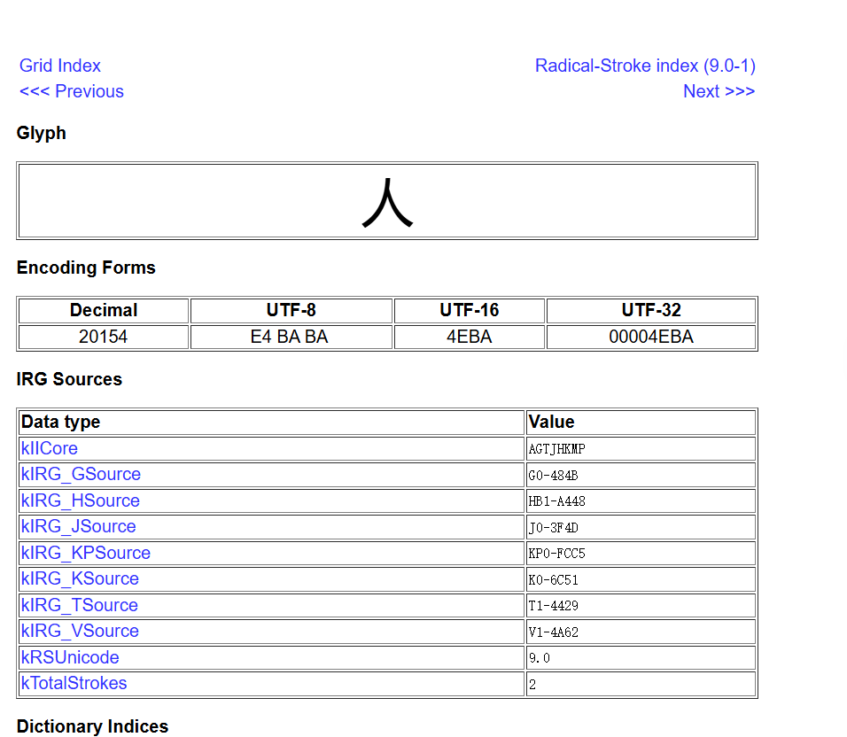
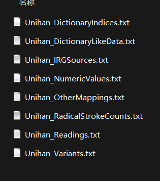

# 脚本实现
算法本身没有任何复杂度可言，唯一的难点在于如何获取汉字笔画。
## 签文爬取
微信读书上仅有230签，不全，但是搜了一下，有384签的,就直接爬取下来了。

## 笔画获取

### 1. ~~pypinyin库~~
```python
from pypinyin import pinyin, Style

def get_strokes_count(chinese_character):
    pinyin_list = pinyin(chinese_character, style=Style.NORMAL)
    strokes_count = len(pinyin_list[0][0])
    return strokes_count

character = '你'
strokes = get_strokes_count(character)
print(f"汉字'{character}'的笔画数为：{strokes}")
```
实测无效，获取的长度其实是拼音字母的数量。
### 2. 查询相关数据库
#### unihan查笔画
通过[Unihan Database Lookup](https://unicode.org/charts/unihan.html),发现查询结果中有**kTotalStrokes**字段，即为所需的笔画数数据。
作为unicode的官方数据库，目前版本完全满足基本的汉字查询。

最开始打算直接通过lookup发送查询请求，hmmm，太慢了，地址在国外。发现数据库文件本身也不大，就直接下载下来了。
[Unihan下载地址](https://www.unicode.org/Public/zipped/latest/)

打开压缩包，有文件若干。



通过lookup检索得到的结果，我们要的**kTotalStrokes**字段在**IRG Source中**,取出该文件。
在[regex101](https://regex101.com/)中测试正则，取出要的unicode部分和笔画数部分，单独存成文件, 以供查询.

#### 汉字转为unicode
最后的工作就是将汉字转为可用于查询的unicode码
```python
unicode = "U+" + str(hex(ord(char)))[2:].upper()
```
`ord()`可以将字符转为unicode，但是是10进制数字，通过观察lookup结果知道，我们整理出来的unicode键的主体是UTF-16，随即直接将数字转为16进制，去掉起首的`0x`转为`U+`，再统一变为大写字母，就完工了。
